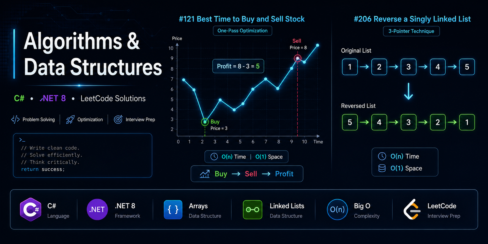
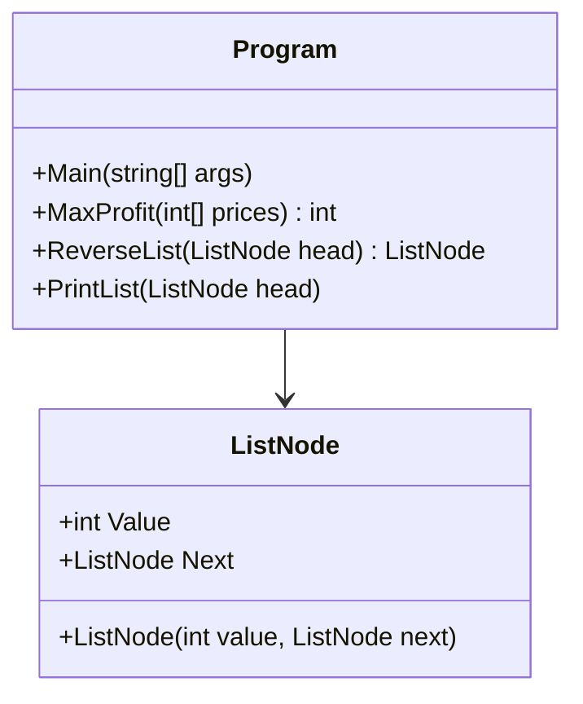
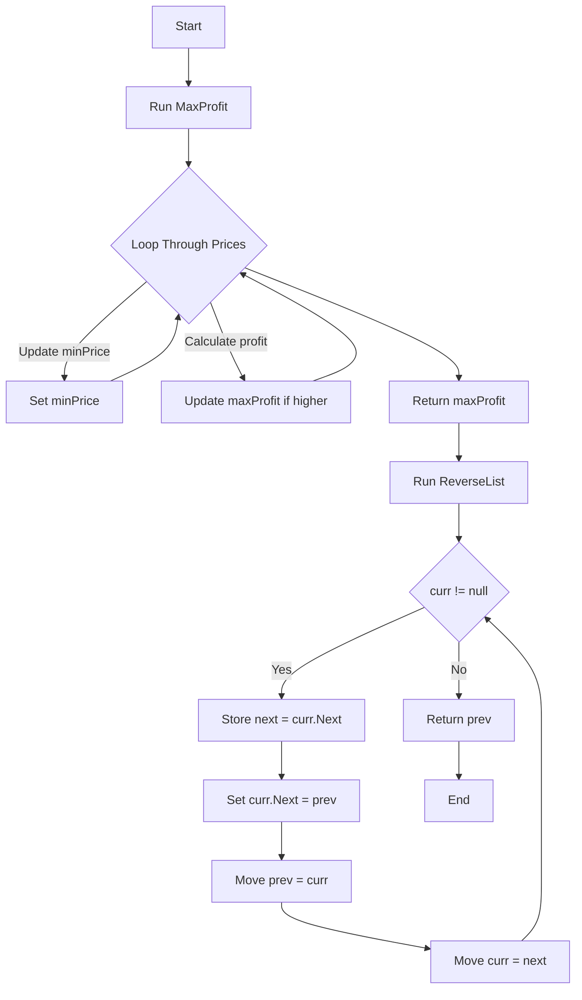

# Algorithms & Data Structures — Assignment 11.2


A clean, professional implementation of two foundational algorithm problems: **Max Profit (LeetCode 121)** and **Reverse Linked List (LeetCode 206)**. This repository demonstrates clear algorithmic thinking, optimized C# solutions, and production‑quality documentation suitable for technical interviews and recruiter review.

---

## 📂 Project Structure

```
Rovy.Assignment11.2
│
├── Program.cs
│
└── Models
    └── ListNode.cs
```

---

# 🧠 Problem 1 — Best Time to Buy and Sell Stock  
**LeetCode #121**  
Category: Arrays / One‑Pass Optimization  
**[Learn more](ca://s?q=Explain_Stock_Problem_121)**

## ✔ Summary  
Track the lowest price seen so far and compute the best possible profit in a single pass.

## ⏱ Complexity  
| Operation | Complexity |
|----------|------------|
| Time     | **O(n)**   |
| Space    | **O(1)**   |

## 💻 Code  
```csharp
public static int MaxProfit(int[] prices)
{
    var minPrice = int.MaxValue;
    var maxProfit = 0;

    foreach (var price in prices)
    {
        if (price < minPrice)
            minPrice = price;

        var profit = price - minPrice;

        if (profit > maxProfit)
            maxProfit = profit;
    }

    return maxProfit;
}
```

---

# 🧠 Problem 2 — Reverse a Singly Linked List  
**LeetCode #206**  
Category: Linked List / Pointers  
**[Learn more](ca://s?q=Explain_Reverse_Linked_List_206)**

## ✔ Summary  
Classic 3‑pointer reversal: `prev`, `curr`, `next`.

## ⏱ Complexity  
| Operation | Complexity |
|----------|------------|
| Time     | **O(n)**   |
| Space    | **O(1)**   |

## 💻 Code  
```csharp
public static ListNode ReverseList(ListNode head)
{
    ListNode prev = null;
    var curr = head;

    while (curr != null)
    {
        var next = curr.Next;
        curr.Next = prev;
        prev = curr;
        curr = next;
    }

    return prev;
}
```

---

# 🧩 ListNode Class  
```csharp
public class ListNode
{
    public int Value { get; set; }
    public ListNode Next { get; set; }

    public ListNode(int value, ListNode next = null)
    {
        Value = value;
        Next = next;
    }
}
```

---

# 🧪 Program Output  
```
Assignment 11.2
Max Profit: 5
Original List:
1 2 3 4 5
Reversed List:
5 4 3 2 1
```

---

# 🧭 UML Diagram (Mermaid)



---

# 🔁 Flowchart (Mermaid)



---

# 🧪 How to Run

1. Clone the repo  
2. Open in Visual Studio  
3. Build the solution  
4. Press **F5**

---

# 🧠 Key Concepts Demonstrated

- One‑pass optimization  
- Pointer manipulation  
- Linked list traversal  
- Clean C# coding standards  
- Interview‑ready explanations  
- Algorithmic thinking  

---

# 👤 Author  
**Bobby Rovy**  
Adaptable. Professional. Clean engineering workflow.  
**[View more projects](ca://s?q=Show_more_projects)**
