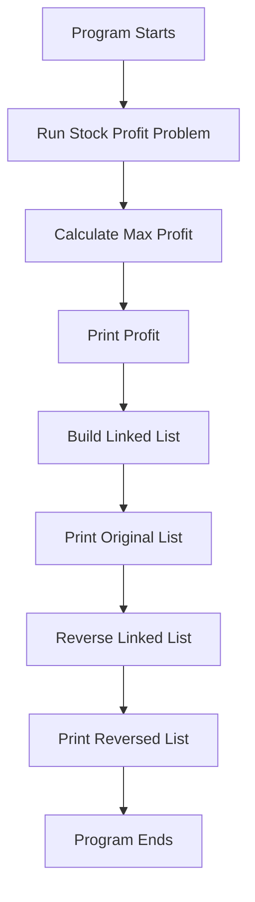
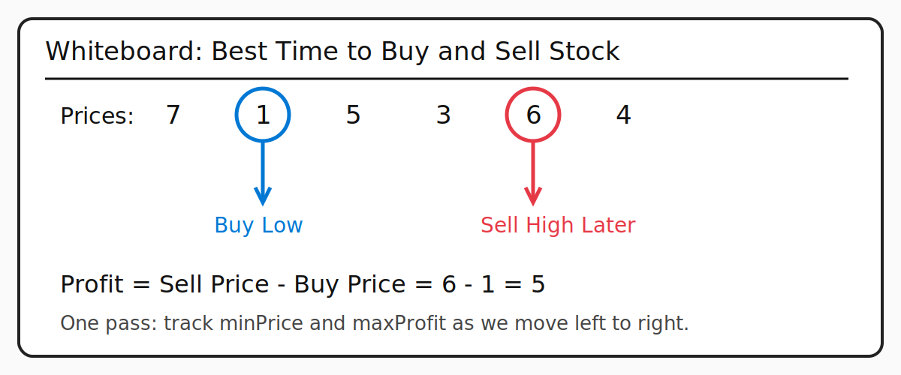
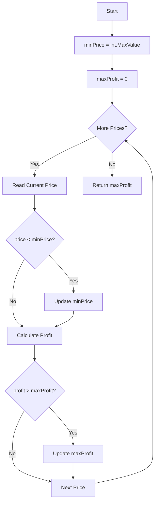
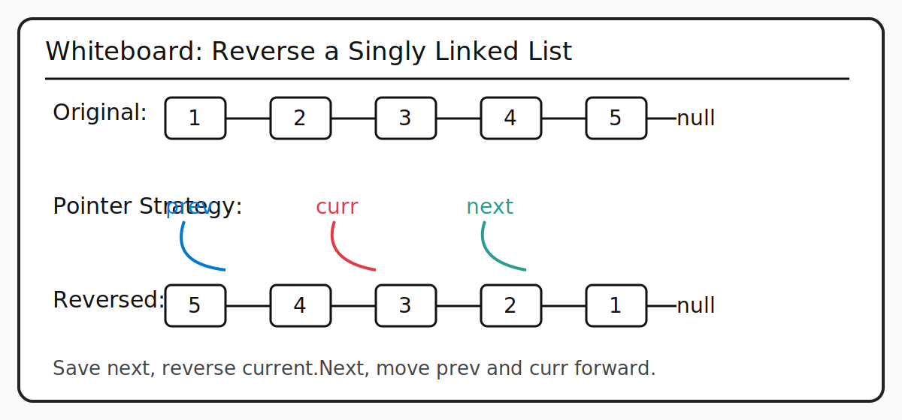
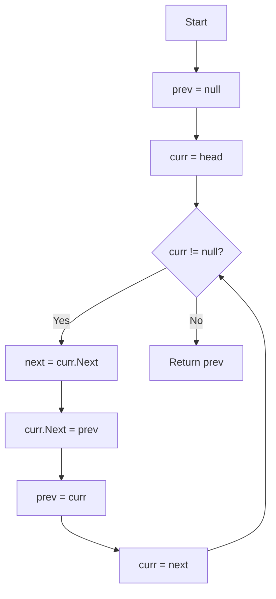
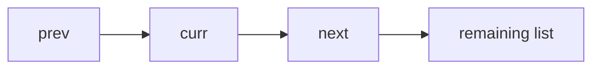
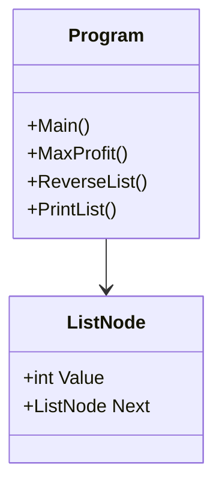

# 🚀 Assignment 11.2 — Algorithms & Data Structures


---

## 📖 Executive Summary

Assignment 11.2 demonstrates two classic software engineering interview problems using C# and .NET 10.

This project focuses on algorithmic problem-solving, clean code, Big-O analysis, linked list manipulation, one-pass optimization, and whiteboard-style technical explanation.

---

## 🎯 Problems Solved

| # | Problem | Category | Time | Space |
|---|---------|----------|------|-------|
| 1 | Best Time to Buy and Sell Stock | Arrays / One-Pass Optimization | **O(n)** | **O(1)** |
| 2 | Reverse a Singly Linked List | Linked Lists / Pointer Manipulation | **O(n)** | **O(1)** |

---

## 🏗 Project Architecture



---

## 📂 Project Structure

```text
Rovy.Assignment11.2
│
├── Program.cs
│
└── Models
    └── ListNode.cs
```

---

# 📈 Problem 1 — Best Time to Buy and Sell Stock

**LeetCode #121**

## Problem Statement

Given an array of stock prices, determine the maximum profit possible from one buy and one sell.

You must buy before you sell.

---

## 🧑‍🏫 Whiteboard Walkthrough



```text
Prices: [7, 1, 5, 3, 6, 4]

Buy at:  1
Sell at: 6

Profit = 6 - 1 = 5
```

---

## 🧠 Logic

Instead of comparing every price against every future price, the algorithm only needs one pass.

Track:

```text
minPrice  = lowest price seen so far
maxProfit = best profit found so far
```

At each price:

```text
1. Update minPrice if current price is lower
2. Calculate profit if sold today
3. Update maxProfit if this profit is better
```

---

## 🔁 Flowchart



---

## 🧪 Dry Run

| Day | Price | Lowest Price | Current Profit | Best Profit |
|----:|------:|-------------:|---------------:|------------:|
| 1 | 7 | 7 | 0 | 0 |
| 2 | 1 | 1 | 0 | 0 |
| 3 | 5 | 1 | 4 | 4 |
| 4 | 3 | 1 | 2 | 4 |
| 5 | 6 | 1 | 5 | 5 |
| 6 | 4 | 1 | 3 | 5 |

---

## 🧾 Pseudocode

```text
SET minPrice = largest possible number
SET maxProfit = 0

FOR each price in prices

    IF price < minPrice
        minPrice = price

    profit = price - minPrice

    IF profit > maxProfit
        maxProfit = profit

RETURN maxProfit
```

---

## ✅ C# Method

```csharp
public static int MaxProfit(int[] prices)
{
    var minPrice = int.MaxValue;
    var maxProfit = 0;

    foreach (var price in prices)
    {
        if (price < minPrice)
            minPrice = price;

        var profit = price - minPrice;

        if (profit > maxProfit)
            maxProfit = profit;
    }

    return maxProfit;
}
```

---

## ⏱ Complexity

| Metric | Complexity |
|--------|------------|
| Time | **O(n)** |
| Space | **O(1)** |

---

# 🔄 Problem 2 — Reverse a Singly Linked List

**LeetCode #206**

## Problem Statement

Given the head of a singly linked list, reverse the list and return the new head.

---

## 🧑‍🏫 Whiteboard Walkthrough



### Before

```text
1 → 2 → 3 → 4 → 5 → null
```

### After

```text
5 → 4 → 3 → 2 → 1 → null
```

---

## 🧠 Logic

Use three pointers:

```text
prev = previous node
curr = current node
next = saved next node
```

The key idea:

```text
Save next before breaking the current link.
Then reverse curr.Next.
Then move prev and curr forward.
```

---

## 🔁 Flowchart



---

## 🔀 Pointer Movement



---

## 🧪 Dry Run

```text
Original:

1 → 2 → 3 → 4 → 5 → null
```

```text
Step 1:

prev = null
curr = 1
next = 2

Flip:
1 → null
```

```text
Step 2:

prev = 1
curr = 2
next = 3

Flip:
2 → 1 → null
```

```text
Step 3:

3 → 2 → 1 → null
```

```text
Step 4:

4 → 3 → 2 → 1 → null
```

```text
Step 5:

5 → 4 → 3 → 2 → 1 → null
```

---

## 🧾 Pseudocode

```text
SET prev = null
SET curr = head

WHILE curr is not null

    SET next = curr.next

    SET curr.next = prev

    SET prev = curr

    SET curr = next

RETURN prev
```

---

## ✅ C# Method

```csharp
public static ListNode ReverseList(ListNode head)
{
    ListNode prev = null;
    var curr = head;

    while (curr != null)
    {
        var next = curr.Next;

        curr.Next = prev;

        prev = curr;
        curr = next;
    }

    return prev;
}
```

---

## ⏱ Complexity

| Metric | Complexity |
|--------|------------|
| Time | **O(n)** |
| Space | **O(1)** |

---

# 🧩 Class Diagram



---

# 📊 Complexity Comparison

```mermaid
graph LR
    A[Best Time to Buy and Sell Stock] --> B[Time O(n)]
    A --> C[Space O(1)]

    D[Reverse Linked List] --> E[Time O(n)]
    D --> F[Space O(1)]
```

---

# ▶️ Sample Output

```text
Assignment 11.2

Max Profit: 5

Original List:
1 2 3 4 5

Reversed List:
5 4 3 2 1
```

---

# 💻 Technologies Used

| Technology | Purpose |
|------------|---------|
| C# | Programming Language |
| .NET 10 | Target Framework |
| Console Application | Application Type |
| Arrays | Stock Price Problem |
| Linked Lists | Reverse List Problem |
| Visual Studio | Development Environment |

---

# 🧠 Key Concepts Demonstrated

- Arrays
- Linked Lists
- One-Pass Algorithms
- Greedy Thinking
- Pointer Manipulation
- Big-O Analysis
- Clean C# Code
- Technical Whiteboarding
- Interview-Style Problem Solving

---

# 🧑‍💼 Interview Explanation

If explaining this at a whiteboard:

For the stock problem, I would explain that I only need to scan the array once. I keep track of the lowest price seen so far and compare each current price against it to determine the best possible profit at that moment.

For the linked list problem, I would explain that I reverse the list in-place using three pointers. I save the next node before changing the current pointer so I do not lose the rest of the list.

---

# 👨‍💻 Author

**Robert (Bobby) Rovy**

- 🇺🇸 U.S. Army Veteran
- Microsoft Software & Systems Academy
- AZ-104 Certified
- Aspiring Software Engineer
