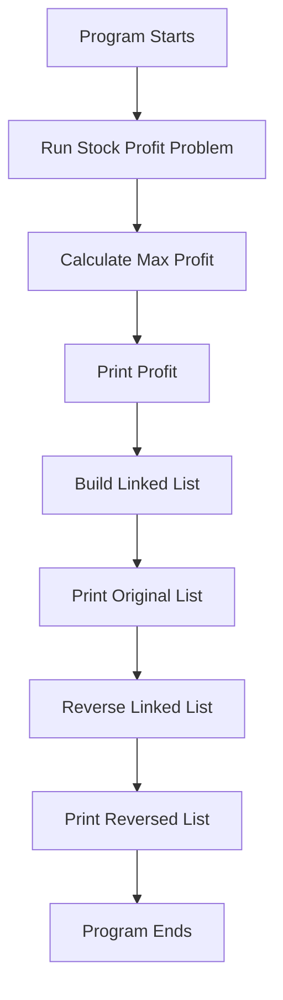
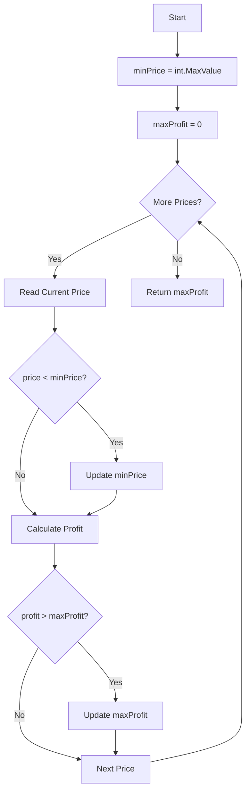
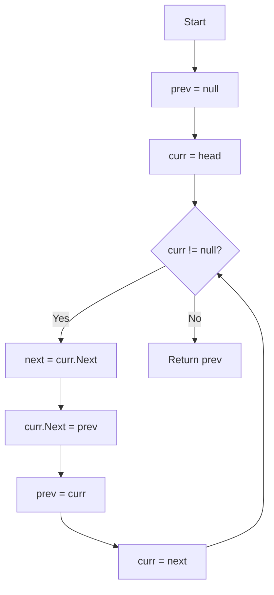
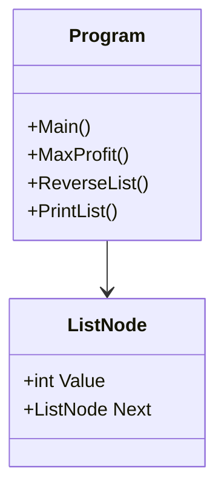

<svg width="1200" height="500" viewBox="0 0 1200 500" xmlns="http://www.w3.org/2000/svg">
  <rect width="1200" height="500" fill="#fafafa"/>
  <rect x="25" y="25" width="1150" height="450" rx="18" fill="#ffffff" stroke="#222" stroke-width="4"/>

  <text x="60" y="80" font-family="Comic Sans MS, Arial" font-size="34" fill="#111">
    Whiteboard: Best Time to Buy and Sell Stock
  </text>

  <line x1="60" y1="105" x2="1130" y2="105" stroke="#111" stroke-width="3"/>

  <text x="80" y="165" font-family="Comic Sans MS, Arial" font-size="30" fill="#111">
    Prices:
  </text>

  <g font-family="Comic Sans MS, Arial" font-size="34" fill="#111">
    <text x="220" y="165">7</text>
    <text x="340" y="165">1</text>
    <text x="460" y="165">5</text>
    <text x="580" y="165">3</text>
    <text x="700" y="165">6</text>
    <text x="820" y="165">4</text>
  </g>

  <g stroke="#0078D4" stroke-width="5" fill="none">
    <circle cx="350" cy="153" r="35"/>
    <path d="M350 190 L350 265"/>
    <path d="M340 250 L350 270 L360 250"/>
  </g>

  <text x="285" y="310" font-family="Comic Sans MS, Arial" font-size="28" fill="#0078D4">
    Buy Low
  </text>

  <g stroke="#E63946" stroke-width="5" fill="none">
    <circle cx="710" cy="153" r="35"/>
    <path d="M710 190 L710 265"/>
    <path d="M700 250 L710 270 L720 250"/>
  </g>

  <text x="640" y="310" font-family="Comic Sans MS, Arial" font-size="28" fill="#E63946">
    Sell High Later
  </text>

  <text x="80" y="390" font-family="Comic Sans MS, Arial" font-size="32" fill="#111">
    Profit = Sell Price - Buy Price = 6 - 1 = 5
  </text>

  <text x="80" y="440" font-family="Comic Sans MS, Arial" font-size="26" fill="#444">
    One pass: track minPrice and maxProfit as we move left to right.
  </text>
</svg>


# 🚀 Assignment 11.2 — Algorithms & Data Structures


---

## 📖 Executive Summary

Assignment 11.2 demonstrates two classic software engineering interview problems using C# and .NET 10.

This project focuses on algorithmic problem‑solving, clean code, Big‑O analysis, linked list manipulation, one‑pass optimization, and whiteboard‑style technical explanation.

---

## 🎯 Problems Solved

| # | Problem | Category | Time | Space |
|---|---------|----------|------|-------|
| 1 | Best Time to Buy and Sell Stock | Arrays / One‑Pass Optimization | **O(n)** | **O(1)** |
| 2 | Reverse a Singly Linked List | Linked Lists / Pointer Manipulation | **O(n)** | **O(1)** |

---

## 🏗 Project Architecture



---

## 📂 Project Structure

```text
Rovy.Assignment11.2
│
├── Program.cs
│
└── Models
    └── ListNode.cs
```

---

# 📈 Problem 1 — Best Time to Buy and Sell Stock  
**LeetCode #121**

---

## 🧑‍🏫 Whiteboard Walkthrough


```text
Prices: [7, 1, 5, 3, 6, 4]

Buy at:  1
Sell at: 6

Profit = 6 - 1 = 5
```

---

## 🧠 Logic

Track:

```text
minPrice  = lowest price seen so far
maxProfit = best profit found so far
```

At each price:

```text
1. Update minPrice if current price is lower
2. Calculate profit if sold today
3. Update maxProfit if this profit is better
```

---

## 🔁 Flowchart



---

## 🧪 Dry Run

| Day | Price | Lowest Price | Current Profit | Best Profit |
|----:|------:|-------------:|---------------:|------------:|
| 1 | 7 | 7 | 0 | 0 |
| 2 | 1 | 1 | 0 | 0 |
| 3 | 5 | 1 | 4 | 4 |
| 4 | 3 | 1 | 2 | 4 |
| 5 | 6 | 1 | 5 | 5 |
| 6 | 4 | 1 | 3 | 5 |

---

## 🧾 Pseudocode

```text
SET minPrice = largest possible number
SET maxProfit = 0

FOR each price in prices

    IF price < minPrice
        minPrice = price

    profit = price - minPrice

    IF profit > maxProfit
        maxProfit = profit

RETURN maxProfit
```

---

## ✅ C# Method

```csharp
public static int MaxProfit(int[] prices)
{
    var minPrice = int.MaxValue;
    var maxProfit = 0;

    foreach (var price in prices)
    {
        if (price < minPrice)
            minPrice = price;

        var profit = price - minPrice;

        if (profit > maxProfit)
            maxProfit = profit;
    }

    return maxProfit;
}
```

---

## ⏱ Complexity

| Metric | Complexity |
|--------|------------|
| Time | **O(n)** |
| Space | **O(1)** |

---

# 🔄 Problem 2 — Reverse a Singly Linked List  
**LeetCode #206**

---

## 🧑‍🏫 Whiteboard Walkthrough


### Before

```text
1 → 2 → 3 → 4 → 5 → null
```

### After

```text
5 → 4 → 3 → 2 → 1 → null
```

---

## 🧠 Logic

Use three pointers:

```text
prev = previous node
curr = current node
next = saved next node
```

---

## 🔁 Flowchart



---

## 🧪 Dry Run

```text
1 → 2 → 3 → 4 → 5 → null
```

```text
Step 1: 1 → null
Step 2: 2 → 1 → null
Step 3: 3 → 2 → 1 → null
Step 4: 4 → 3 → 2 → 1 → null
Step 5: 5 → 4 → 3 → 2 → 1 → null
```

---

## 🧾 Pseudocode

```text
SET prev = null
SET curr = head

WHILE curr is not null

    SET next = curr.next

    SET curr.next = prev

    SET prev = curr

    SET curr = next

RETURN prev
```

---

## ✅ C# Method

```csharp
public static ListNode ReverseList(ListNode head)
{
    ListNode prev = null;
    var curr = head;

    while (curr != null)
    {
        var next = curr.Next;

        curr.Next = prev;

        prev = curr;
        curr = next;
    }

    return prev;
}
```

---

## ⏱ Complexity

| Metric | Complexity |
|--------|------------|
| Time | **O(n)** |
| Space | **O(1)** |

---

# 🧩 Class Diagram



---

# 📊 Complexity Comparison

```mermaid
graph LR
    A[Best Time to Buy and Sell Stock] --> B[Time O(n)]
    A --> C[Space O(1)]

    D[Reverse Linked List] --> E[Time O(n)]
    D --> F[Space O(1)]
```

---

# ▶️ Sample Output

```text
Assignment 11.2

Max Profit: 5

Original List:
1 2 3 4 5

Reversed List:
5 4 3 2 1
```

---

# 💻 Technologies Used

| Technology | Purpose |
|------------|---------|
| C# | Programming Language |
| .NET 10 | Target Framework |
| Console Application | Application Type |
| Arrays | Stock Price Problem |
| Linked Lists | Reverse List Problem |
| Visual Studio | Development Environment |

---

# 🧠 Key Concepts Demonstrated

- Arrays  
- Linked Lists  
- One‑Pass Algorithms  
- Greedy Thinking  
- Pointer Manipulation  
- Big‑O Analysis  
- Clean C# Code  
- Technical Whiteboarding  
- Interview‑Style Problem Solving  

---

# 👨‍💼 Author

**Robert (Bobby) Rovy**  
- 🇺🇸 U.S. Army Veteran  
- Microsoft Software & Systems Academy  
- AZ‑104 Certified  
- Aspiring Software Engineer  
